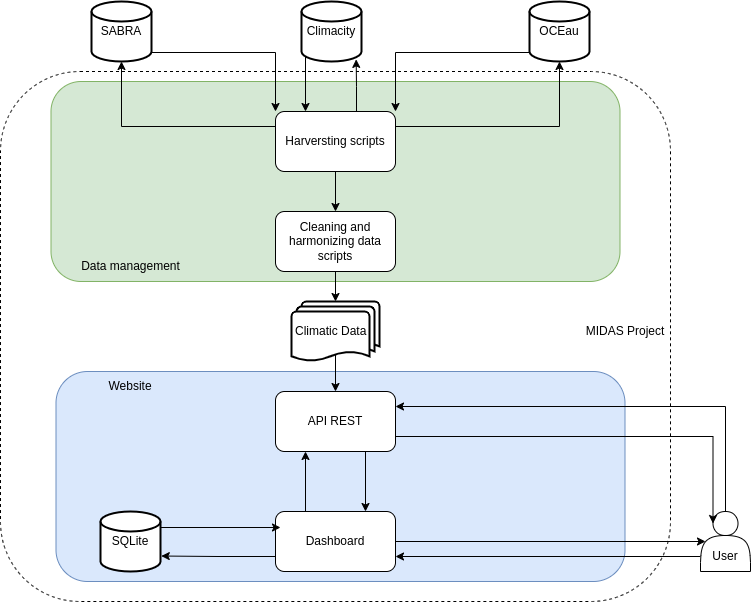

# MIDAS

Le projet MIDAS porte sur le climat urbain à Genève. Celui-ci a été réalisé en collaboration entre la Haute école de gestion de Genève (HEG-GE) et la Haute école du paysage, d'ingénierie et d'architecture (HEPIA). Il a notamment donné lieu à deux Hackathons SmartCity Xperience, et plusieurs Data Stories. Plus d'informations sur le projet au lien suivant : [https://campus.hesge.ch/id_bilingue/projekte/MIDAS/index.html](https://campus.hesge.ch/id_bilingue/projekte/MIDAS/index.html).

Dans le cadre de ce projet, il est apparu le besoin de centraliser divers types de données climatiques et de pouvoir les visualiser rapidement et facilement à l'aide d'un dashboard dédié afin de mieux comprendre et anticiper les phénomènes liés au climat urbain. Celui-ci est accessible à l'url suivante : [https://gexplore.ch/](https://gexplore.ch/).

Architecture de l'application web :

## Choix des technologies

Pour réaliser le dashboard, nous avons décidé d'utiliser le framework Django. Celui-ci nous offre une grande flexibilité pour la récolte de données et leur traitement à l'aide du langage Python, ainsi que la possibilité de créer simplement et efficacement une API REST dédiée grâce aux modules déjà existants.

Concernant la base de données, nous avons opté pour MySQL pour sa rapidité, stabilité et facilité d'utilisation.

## Données

Les données disponibles sur [https://gexplore.ch/](https://gexplore.ch/) sont extraites de la station de mesures de l'HEPIA, des stations de mesure du Service de l'air, du bruit et des rayonnements non ionisants (SABRA) de Genève, ainsi que des mesures de l'Office cantonal de l'eau (OCEau).

## Backend

Le backend gère la récolte de données auprès de différentes sources, soit au travers de scraping, ou de requêtes sur leur API. Les données sont traitées, normalisées, puis stockées. 

Le principal enjeu auquel nous avons fait face lors de la normalisation des données a été de convenir d'une échelle de temps identique pour toutes les données indépandemment de leur fréquence de mesure. Afin de conserver une certaine granularité sans détériorer artificiellement des mesures journalières, nous avons opté pour un interval horaire. Les mesures ont donc été ajustées soit en réalisant une moyenne, soit en duplicant la valeur sur cette unité.

Les emplacements des stations de mesure sont également enregistrés dans notre base de données MySQL. Un système d'utilisateur a également été implémenté afin de permettre la création de Tokens pour l'utilisation de l'API REST mise à disposition.

## Frontend

La partie frontend est quant à elle écrite en JavaScript à l'aide de la librairie ECharts pour la visualisation des données. Le dashboard peut être utilisé de deux façons :

La première utilise une carte d'OpenStreetMap, centre la vue de celle-ci sur Genève et dessine des marqueurs sur les emplacements dont nous possédons des données. La sélection s'effectue directement sur les stations et il est possible de choisir le type de mesures à afficher. Elle a spécifiquement été développée pour l'accessibilité et l'expérience utilisateur.

La seconde est une vue simplifiée où la sélection des données à afficher s'effectue en choisisant d'abord la source des données, puis la station qui nous intéresse, et finalement les paramètres. Il devient alors possible de croiser plusieurs paramètres différents ou à des échelles de temps différentes. Cette version est destinée à un public qui sait ce qu'il recherche ou souhaite effectuer des requêtes plus complexes.

## API

Afin de permettre non seulement la visualisation des données, mais également leur exploitation. Nous avons mis en place une API REST accessible pour les personnes possèdant un compte. Ils peuvent ainsi créer des tokens pour des accès sécurisés et un usage contrôlé afin d'effectuer des requêtes adaptées à leurs besoins en matière de recherche climatique.

L'objectif est de faciliter l'accès des données climatiques du canton de Genève aux institutions et aux chercheurs. 

## Intégration et déploiement continu

Afin de faciliter l'intégration et le déploiement de l'application web, nous avons dans un premier temps conteneurisé cette dernière avec Docker grâce aux GitHub Actions. Dans un second temps, lorsque l'image est générée, celle-ci est automatiquement téléchargée par le serveur de production et déployée.

## Code Open Source

Le Dashboard est open source. Il se veut transparent et réutilisable par d'autres organismes souhaitant développer une solution similaire. De plus, le projet est ouvert aux contributions, et nous encourageons les développeurs à participer à l'amélioration et l'évolution de cet outil.
